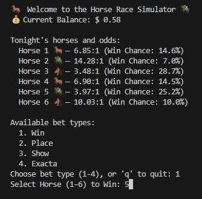
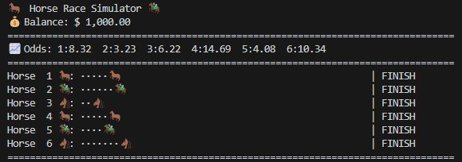

# 🐴 CLI Derby

A retro-style command-line horse racing simulator where you bet virtual dollars, watch animated races, and test your luck and instincts like a trackside legend — all from your terminal.

  
*Race screen with emoji horses, odds, and live updates*

---

## 🎮 Features

- 🐎 Simulated 6-horse races with real-time progress
- 💸 Place bets: Win, Place, Show, or Exacta
- 🎲 Dynamically generated odds per race
- 📊 Animated race display using emoji and ASCII
- 💰 Persistent bankroll tracking per session

  
*Betting UI showing live odds, betting options, and balance*

---

## 🧪 Betting Types

| Bet Type | Description                         | Payout Formula                        |
|----------|-------------------------------------|----------------------------------------|
| Win      | Pick the winner                     | stake × fair odds                     |
| Place    | Finish in 1st or 2nd                | stake × (1 / win_prob × 2)            |
| Show     | Finish in top 3                     | stake × (1 / win_prob × 3)            |
| Exacta   | Predict 1st and 2nd in exact order  | stake × (1 / (p1 × p2))               |

---

## 🏁 Run the Game

```bash
python main.py
✅ Works in Windows Terminal, VS Code, macOS, and Linux
✅ No external libraries needed
✅ Python 3.7+ only

📁 Folder Structure
cli_derby/
├── main.py                        # Core game script
├── horse_racing_cli.jpg           # Screenshot: race in progress
├── horse_racing_cli_betting.jpg   # Screenshot: betting UI
└── README.md                      # This file

💬 Sample Output
🥇 Horse 2 🏇
🥈 Horse 3 🐴
🥉 Horse 1 🐎

✅ WIN! You receive $ 198.25
💵 New Balance: $ 1,548.25
👨‍💻 Author
Developed by Ash Vernon
Feel free to fork, enhance, or gamble recklessly (in-game only).

📜 License
MIT — fork it, remix it, race it. No wagering real money, please.
